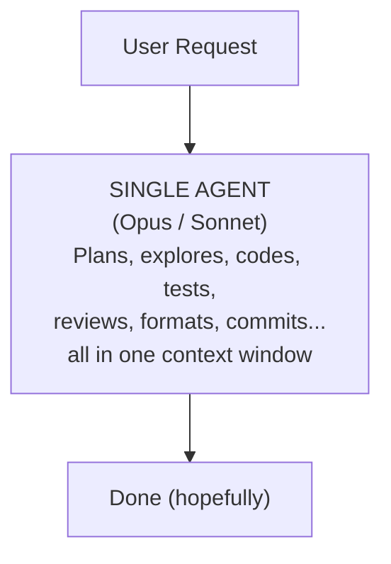
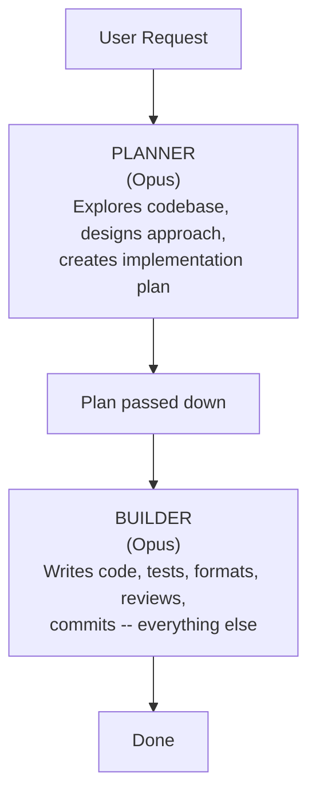
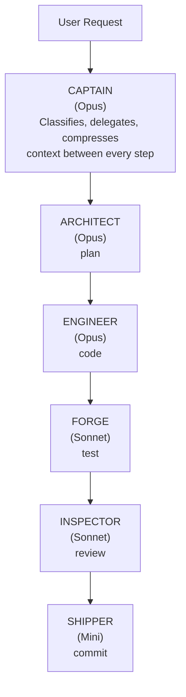
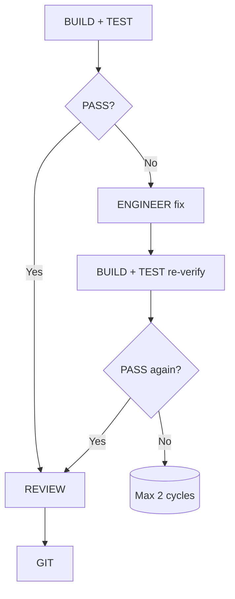
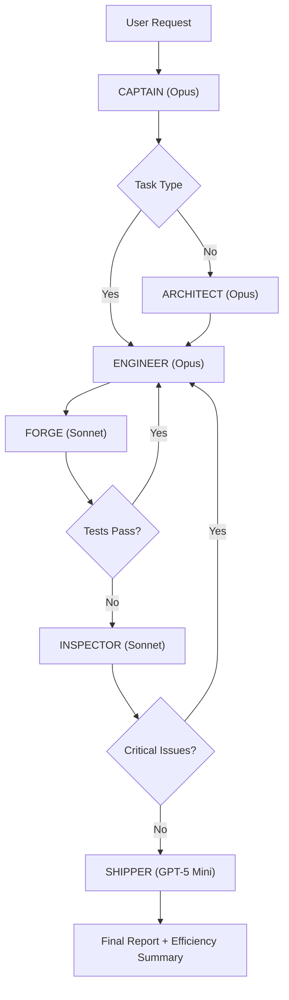

# AI Agent Team Pipeline for OpenCode

## What Is This?

A **6-agent orchestration system** for [OpenCode](https://opencode.ai) that replaces the default single-agent workflow with a structured, sequential pipeline. Instead of one AI agent doing everything (planning, coding, testing, reviewing, committing), a **Captain agent** delegates to 5 specialized subagents -- each with its own model tier, permissions, and focused prompt.

The result: higher code quality, lower token costs, and a predictable workflow that mirrors how a real engineering team operates.

## The Evolution: Before and Now

Most AI coding tools follow one of two patterns. This pipeline introduces a third.

### Stage 1: The All-in-One Agent

A single agent handles everything -- planning, coding, testing, reviewing, and committing -- in one long conversation.



**How it works:** The user describes a task. The agent thinks, writes code, runs tests, fixes failures, and commits -- all in a single thread. Every tool call (Claude Code, Cursor, default OpenCode, Copilot agent mode) typically works this way.

**The problems:**
- **Context bloat** -- the agent accumulates everything (exploration output, failed attempts, test logs) in one growing context, burning tokens on stale information
- **No separation of concerns** -- the same agent that writes code also reviews it (self-review catches less)
- **No cost control** -- expensive frontier models are used for mechanical tasks (formatting, git commits) that don't need them
- **Unpredictable workflow** -- the agent decides what to do next with no enforced structure

### Stage 2: The Two-Agent Split

A planner agent designs the approach, then a builder agent implements it.



**How it works:** The first agent focuses purely on understanding the problem and designing a solution. Its plan is passed to a second agent that handles all implementation. This is the pattern used by some multi-file editing tools and "plan then execute" workflows.

**The improvements:**
- Planning and implementation are decoupled -- the builder gets a clear plan instead of figuring it out while coding
- Context is somewhat compressed between agents -- the builder doesn't see raw exploration output

**The remaining problems:**
- **The builder is still an all-in-one** -- it codes, tests, reviews, formats, and commits in a single agent
- **Still no independent review** -- the same agent that writes code judges its own quality
- **No model tiering** -- both agents use the same expensive model, even for mechanical tasks
- **No structured remediation** -- if tests fail, there's no enforced loop, just the builder trying again

### Stage 3: The 6-Agent Pipeline (This System)

Six specialized agents, each with a focused role, enforced ordering, model tiering, and structured remediation loops.



**What changed:**
- **Every concern is separated** -- planning, coding, testing, reviewing, and shipping each have a dedicated agent
- **Independent review** -- the Inspector never sees the Engineer's reasoning, only the code diff
- **Model tiering** -- validation and shipping use cheaper models; only reasoning-heavy tasks use Opus
- **Structured remediation** -- test failures route back to the Engineer, not handled ad-hoc by whoever is running
- **Context compression** -- the Captain compresses output between every step, preventing context snowball
- **Budget guardrails** -- hard caps on invocations prevent runaway retry loops

### Side-by-Side Comparison

| | All-in-One | Two-Agent | 6-Agent Pipeline |
|---|---|---|---|
| **Agents** | 1 | 2 | 6 |
| **Separation of concerns** | None | Plan vs Build | Full (plan, code, test, review, ship) |
| **User approval gate** | No | No | Yes (after plan, before code) |
| **Independent review** | No (self-review) | No (self-review) | Yes (Inspector is separate) |
| **Model tiering** | No | No | Yes (3 tiers) |
| **Context management** | Grows unbounded | Split once | Compressed at every step |
| **Remediation loops** | Ad-hoc | Ad-hoc | Structured (max 2 cycles) |
| **Cost control** | None | None | Budget guardrails per task |
| **Workflow predictability** | Low | Medium | High (enforced pipeline) |


## The Agent Roster

| Agent | Role | Model Tier | Cost |
|-------|------|-----------|------|
| **Captain** | Orchestrator -- classifies tasks, delegates, compresses context | Full (Opus) | High |
| **Architect** | Explores codebase, analyzes requirements, designs architecture | Full (Opus) | High |
| **Engineer** | Writes/edits code, updates documentation | Full (Opus) | High |
| **Forge** | Formats code, compiles assets, runs tests, fixes test files | Mid (Sonnet) | Medium |
| **Inspector** | Code quality review + OWASP security audit | Mid (Sonnet) | Medium |
| **Shipper** | Commits, pushes, analyzes CI pipelines | Light (GPT-5 Mini) | Low |

> [!NOTE]  
> We can switch the LLM model to any desired option, including its reasoning capabilities.

## The Pipeline

Every task flows through a strict sequential pipeline. The Captain never skips ahead -- each step must complete before the next begins.

```
1. PLAN+EXPLORE  -> Architect       Understand the problem, explore code, design solution
── USER APPROVAL GATE ──            Present plan to user, wait for approval
2. IMPLEMENT     -> Engineer        Write the code following the plan
3. BUILD+TEST    -> Forge           Format, build, run tests, fix test files
4. REVIEW        -> Inspector       Quality + security audit
5. GIT           -> Shipper         Commit, push, check CI
```

Tasks are classified into 4 tiers (trivial, simple, standard, complex), and the pipeline adapts -- trivial tasks skip planning entirely, simple tasks skip review, etc.

After the Architect delivers its plan, the Captain **always presents the plan to the user for approval** before any code is written. The user can approve, adjust, or reject. This prevents wasted tokens on wrong implementations and keeps the user in control of architectural decisions.

When tests fail or the reviewer finds critical issues, a **remediation loop** kicks in: failures route back to the Engineer for fixes, then re-run validation. The Captain never fixes code itself -- it purely orchestrates.

### Remediation Flow



## How We Reduced Token/Cost Usage

We applied **8 strategies** across the system, consolidated from an initial 12-agent design down to 6.

### 1. Agent Consolidation (12 -> 8 -> 6 agents)

Merged 6 agents into others: Architect stayed as Architect, Formatter -> Forge, Security -> Inspector, Docs -> Engineer, Explorer -> Architect, Tester -> Forge. Fewer agents = fewer invocations = fewer tokens.

### 2. Model Tiering

Not every task needs the most expensive model. The Forge and Inspector use Sonnet (mid-tier), Shipper uses GPT-5 Mini (light-tier). Only the Architect, Engineer, and Captain use Opus. This alone cuts cost significantly -- validation and coordination tasks don't need frontier reasoning.

```
Full  (Opus)       -> Captain, Architect, Engineer       [reasoning-heavy]
Mid   (Sonnet)     -> Forge, Inspector                   [structured tasks]
Light (GPT-5 Mini) -> Shipper                            [mechanical tasks]
```

### 3. Context Compression

After each subagent returns, the Captain compresses output to **2-4 bullet points** before passing to the next agent. This prevents "context snowball" -- where each agent gets the full verbose output of every previous agent, ballooning token usage across the pipeline.

**Example:**
- Architect returns 200 lines of analysis -> compressed to: file paths, 3 implementation steps, 1 risk note
- Forge returns full test output -> compressed to: "14 tests passed, 0 failed"

### 4. Conditional Exploration Depth

The Architect does a lightweight 3-step exploration for simple tasks, but a full 7-step deep dive for standard/complex tasks. No point spending tokens exploring the entire codebase for a bug fix.

### 5. Stricter Output Caps

| Agent | On Success | On Failure |
|-------|-----------|-----------|
| Forge | Test counts + status only | First 10 lines of errors |
| Inspector | Critical/high = full detail | Medium = finding + fix only |
| Inspector | Low/suggestions = max 15 words each | Empty sections omitted |

### 6. Trivial Self-Handle

For truly trivial edits (typo, config change, rename), the Captain makes the edit directly instead of spinning up the full pipeline -- but still always invokes the Forge for testing.

### 7. Conditional Session Persistence

The resume protocol (checkpoint files for interrupted work) only activates for standard/complex tasks. Trivial and simple tasks complete fast enough that persistence is overhead.

### 8. Pipeline Budget Guardrails

Each task classification has a hard cap on subagent invocations (including retries):

| Classification | Max Invocations | Typical Usage |
|---------------|----------------|---------------|
| Trivial | 3 | forge + shipper + 1 retry |
| Simple | 6 | 4 steps + 2 retries |
| Standard | 8 | 5 steps + 3 retries |
| Complex | 12 | 5 steps + remediation loops |

When the budget is exhausted, the pipeline stops and asks the user -- preventing runaway retry loops that silently burn tokens.

## Efficiency Awareness (Inspired by GreenAgent)

[GreenAgent](https://github.com/edgarasLegusVisma/greenagent) is a project that classifies LLM workflow steps as **useful work**, **overhead**, or **potential waste** -- tracking tokens, cost, energy, and carbon per step.

Direct integration wasn't possible (GreenAgent wraps direct API calls; OpenCode manages its own calls internally), but we adopted its **conceptual framework** into the pipeline:

### Step Categorization

Every pipeline step is labeled with a GreenAgent-style category:

| Category | Steps | Purpose |
|----------|-------|---------|
| `[overhead]` | Plan+Explore, Git | Necessary but not direct output |
| `[useful-work]` | Implement | Produces the deliverable |
| `[validation]` | Build+Test, Review | Verifies the deliverable |

### Efficiency Reporting

The pipeline's final report includes an efficiency line:

```
Pipeline: 4/5 steps | 6 invocations (budget: 8) | useful-work: 2, validation: 2, overhead: 2
```

### Retrospective Classification

If a task was classified as "standard" but turned out to only touch 1-2 files with no design needed, the report notes it could have been simpler. This creates a feedback loop for improving future classification accuracy.

```
Retrospective: task could have been classified as simple (single-file change, no design needed).
```

### How This Saves Waste

- **Budget guardrails** directly address the "potential waste" category by stopping runaway retry loops before they burn unnecessary tokens
- **Model tiering** ensures expensive models are only used where reasoning complexity demands it
- **Context compression** prevents the exponential context growth that is one of the largest hidden costs in multi-agent systems
- **Conditional depth** avoids spending exploration tokens on tasks that don't need it

## Other Notable Design Decisions

### Language/Framework Agnostic

All agent prompts use universal concepts (manifest files, build tools, test runners) rather than framework-specific language. Project-level skills and config handle technology specifics. The same agent team works across Laravel, React, Rust, Python -- any codebase.

### Independent Review

We deliberately kept the Inspector as a separate agent rather than merging it into the Engineer. Self-review is a known anti-pattern -- an independent reviewer catches what the author misses, even when the "author" is an AI.

### Remediation Loops with Delegation Discipline

When tests fail or the reviewer finds critical issues, fixes route through the Engineer (never the Captain). The Captain has three layers of reinforcement to prevent it from "helpfully" fixing code itself:

1. Opening instruction: "NEVER attempt to resolve it yourself"
2. Technical Failure Handling: "you are an orchestrator, not a worker"
3. Remediation Loop: "NEVER fix code yourself -- always delegate to @team-engineer"

### Hidden Subagents

All 5 subagents are hidden from the `@` autocomplete menu. They only appear when invoked by the Captain via the Task tool. This keeps the UI clean and prevents accidental direct invocation.

### Session Persistence

For longer tasks, the Captain maintains a `.opencode/resume.md` checkpoint file. If a session is interrupted, the user can say "resume" and pick up exactly where they left off -- no re-exploring the codebase or re-deriving the plan.

## Architecture Overview



## How to Use

### Prerequisites

- [OpenCode](https://opencode.ai) installed and configured with at least one provider
- Access to the models you want to use (Opus, Sonnet, GPT-5 Mini) or adjust model assignments in the agent files to match your available models

### Installation

**Step 1: Copy the agent files to your global OpenCode config directory.**

```bash
mkdir -p ~/.config/opencode/agents
```

Place all 6 agent files in `~/.config/opencode/agents/`:

```
~/.config/opencode/agents/
├── team-captain.md       # Primary orchestrator
├── team-architect.md     # Plan + explore + architecture
├── team-engineer.md      # Write/edit code + docs
├── team-forge.md         # Format + build + test
├── team-inspector.md     # Quality + security review
└── team-shipper.md       # Commit, push, CI analysis
```

These are **global agents** -- they work across all your projects, not just one.

**Step 2: Set the Captain as your default agent.**

Edit (or create) `~/.config/opencode/opencode.json`:

```json
{
  "$schema": "https://opencode.ai/config.json",
  "default_agent": "team-captain"
}
```

The `default_agent` setting makes every new conversation start with the Captain automatically. Without this, you'd need to manually select `@team-captain` each time.

**Step 3 (optional): Adjust model assignments.**

Each agent file has a `model` field in its frontmatter. If you don't have access to the exact models used, edit the agent files to match your available models:

```yaml
# In team-forge.md and team-inspector.md (mid-tier)
model: github-copilot/claude-sonnet-4.6

# In team-shipper.md (light-tier)
model: github-copilot/gpt-5-mini
```

Agents without a `model` field (Captain, Architect, Engineer) inherit the globally configured model.

### Usage

Once installed, just use OpenCode normally. The Captain handles everything:

```
> Add a search feature to the users page

# Captain classifies the task (standard), then:
# 1. Invokes Architect to explore codebase and design the approach
# 2. Presents the plan to you for approval
# 3. Invokes Engineer to write the code
# 4. Invokes Forge to format, build, and test
# 5. Invokes Inspector for quality + security audit
# 6. Invokes Shipper to commit (if requested)
# -> Final report with efficiency summary
```

**Requesting a commit:**

```
> Add a search feature to the users page and commit it
```

The Captain will include the Git step and pass commit instructions to the Shipper.

**Resuming interrupted work (standard/complex tasks only):**

```
> resume
```

The Captain checks for `.opencode/resume.md` in the project root and offers to continue from where it left off.

**Trivial edits are fast:**

```
> Fix the typo in the header on the dashboard page
```

The Captain handles the edit directly (no Architect or Engineer needed), but still invokes the Forge to run tests.

### How It Behaves

- **You talk to the Captain only.** The 5 subagents are hidden from the `@` autocomplete -- they're invoked automatically.
- **The Captain will ask clarifying questions** if your request is vague or has trade-offs. Max 3 questions, framed as choices.
- **After planning, you approve the plan.** The Captain presents the Architect's plan (classification, files, steps, risks) and waits for your approval before writing any code. You can approve, adjust, or reject.
- **If something fails**, the Captain retries or routes to the Engineer for fixes. It will never silently swallow errors.
- **The final report** tells you exactly what happened: steps run, steps skipped, issues found, invocation count, and efficiency breakdown.

### Customization

**Adjust pipeline budgets** -- Edit the Pipeline Budget section in `team-captain.md` if the default caps (trivial: 3, simple: 6, standard: 8, complex: 12) are too tight or too loose for your workflow.

**Add project-specific skills** -- Place skill files in your project's `.opencode/agents/skills/` directory. The agents will pick them up automatically for technology-specific guidance (e.g., Laravel, React, Rust conventions).

**Change model tiers** -- Swap models in agent frontmatter to match your budget. For example, use Sonnet everywhere for lower cost, or Opus everywhere for maximum quality.

## Results

The combination of these strategies means:

- **Predictable costs** -- budget guardrails prevent surprise token usage
- **Higher code quality** -- independent review + mandatory testing catches issues early
- **Faster iteration** -- remediation loops fix test failures automatically instead of dumping errors on the user
- **Transferable workflow** -- language-agnostic design works across any project type
- **Visibility** -- efficiency reporting shows exactly where tokens are spent, enabling continuous optimization
